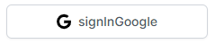
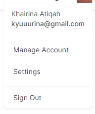
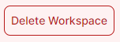
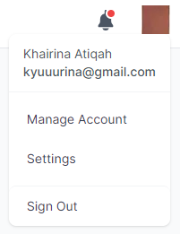
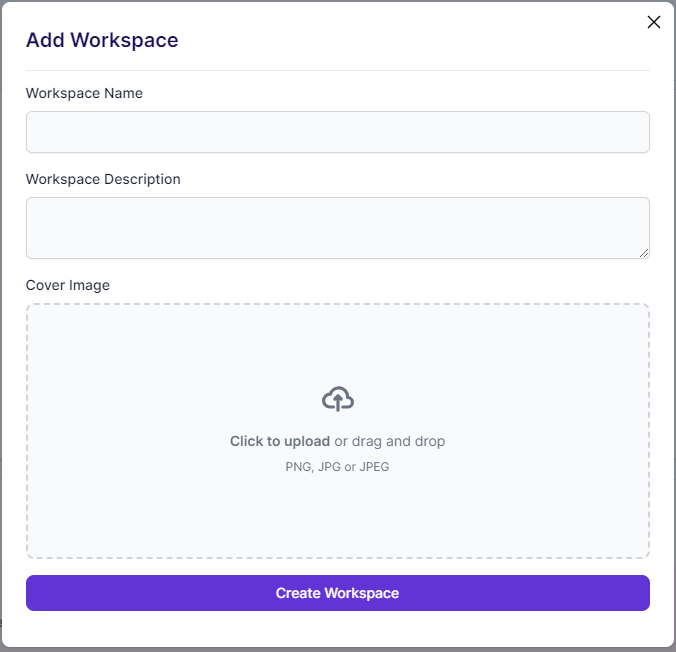
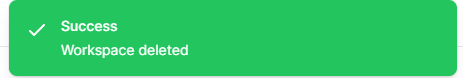
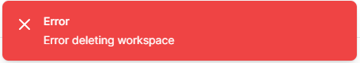
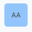
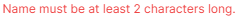

# Component Documentation

Welcome to the documentation for the components. In this guide, you'll find detailed information about the various components available in our repository.

## Table of Contents

- [Auth Folder](#auth-folder)
  - [Google Button](#google-button)
  - [Google Icon](#google-icon)
  - [Signout Button](#signout-button)
- [Button Folder](#button-folder)
  - [Delete Button](#delete-button)
  - [Primary Button](#primary-button)
- [Layout Folder](#layout-folder)
  - [Head](#head)
  - [Layout](#layout)
  - [Navbar](#navbar)
  - [Sidebar](#sidebar)
- [Modal Folder](#modal-folder)
  - [Modal](#modal)
- [Profile Registration Folder](#profile-registration-folder)
- [Toast Folder](#toast-folder)
  - [Success Toast](#success-toast)
  - [Error Toast](#error-toast)
- [Workspace Folder](#workspace-folder)
- [Other Components](#other-components)
  - [Avatar Placeholder](#avatar-placeholder)
  - [Form Error Message](#form-error-message)
  - [Link](#link)

## Auth Folder

This folder stores the components used for account registration and authentication.

#### Google Button



This button allows users to sign in with their Google account. Pass in "signin" or "signup" as a prop to determine the button's functionality.

```js
<GoogleButton type="signin" />
<GoogleButton type="signup" />
```

#### Google Icon

This icon is used to display the Google logo.

#### Signout Button

This button allows users to sign out of their account using Supabase's react authentication library.


## Button Folder
This folder stores the components used for buttons.

#### Delete Button


This button is used to delete a project or workspace. There are three props that can be passed in: 

1. `name` 
2. `onClick`
3. `disabled`. 

The `name` prop is used to name the button. The `onClick` prop is used to determine what happens when the button is clicked. The `disabled` prop is used to disable the button. The `disabled` prop is set to `false` by default and is optional to be used.

**Example: Delete workspace button when the input value is equal to the workspace name**

```js
<DeleteButton
    name="Delete Workspace"
    onClick={
        inputValue === name ? handleDeleteWorkspace : () => console.log("")
    }
    disabled={inputValue !== name}
/>
```

#### Primary Button


This button is used as a primary button. There are three props that can be passed in:

1. ```name``` - The name of the button
2. ```type``` - Type of button which can be either "button" or "submit"

**Example: Primary button with name "Submit" and type "submit" to submit a form**

```js
<form onSubmit={handleSubmit}>
    ...
    <PrimaryButton name="Submit" type="submit" />
</form>
```

## Layout Folder
This folder is used to store the components used for the layout of the application. 

#### Head
This component is used to set the the head of the page. It takes in a ```title``` prop which is used to set the title of the page.

```js
<Head title="Home" />
```
> Please add this component to every page in the ```pages``` folder.

#### Layout
This component is used to set the layout of the page. It takes in a ```children``` prop which is used to set the order of the sidebar, navbar and the main content of the page. 

#### Applying the layout to a page
```js
import { Layout } from "../components";
import { ReactElement } from "react";

// replace Workspace with the name of the page
Workspace.getLayout = function getLayout(page: ReactElement) {
  return (
    <>
      <Layout>{page}</Layout>
    </>
  );
};

export default Workspace;
```

#### Navbar
This component is used to set the navbar of the page. It contains the website logo, notifications menu and the user profile menu.


#### Sidebar
This component is used to set the sidebar of the page. It contains the navigation links to the various pages of the application.

## Modal Folder
This folder is used to store the different modals used in the application.

#### Modal
A basic modal with a header and empty body. It takes in four props:

1. ```show``` - Determines whether the modal is shown or not
2. ```onClose``` - Function to toggle the state of ```show``` to false or true
3. ```children``` - The content of the modal
4. ```title``` - The title of the modal



**Example: Modal with a header and a body**
```js
const [showModal, setShowModal] = useState(false);

<Modal
    show={showModal}
    onClose={() => setShowModal(false)}
    title="Add Workspace"
>
    // place the content of the modal here 
    // (such as a form with a button)
</Modal>
```

## Profile Registration Folder
Folder to store the forms of profile registration after a user signs up an account for the first time. 

## Project Folder
Folder to store the components used for the project page of the project management dashboard.

## Toast Folder
Folder to store the components used for the toast notifications using ```react-hot-toast``` library.

### Getting started with toast notifications
1. Import the toast component from the ```react-hot-toast``` library
```js
import toast from "react-hot-toast";
```
2. Call the ```toast``` custom function with the custom component as the argument
```js
toast.custom(() => <SuccessToast message="Workspace deleted" />);
```

#### Success Toast

A custom toast component to display a success message. It takes in a ```message``` prop which is used to display the success message.

**Example: Success toast with message "Workspace deleted"**
```js
<SuccessToast message="Workspace deleted" />
```

#### Error Toast

A custom toast component to display an error message. It takes in a ```message``` prop which is used to display the error message.

**Example: Error toast with message "Workspace not found"**
```js
<ErrorToast message="Workspace not found" />
```

## Workspace Folder
Folder to store the components used for the workspace page of the project management dashboard.

## Other Components

#### Avatar Placeholder

A placeholder for the user's avatar. It takes in a ```name``` prop which is used to display the user's initials.

**Example: Avatar placeholder with name "John Doe"**
```js
<AvatarPlaceholder name="John Doe" />
```

### Form Error Message

A component to display an error message for a form. It takes in a ```message``` prop which is used to display the error message.

**Example: Form error message with message "Workspace name is required"**
```js
{errors.description && (
    <FormErrorMessage text={errors.description.message} />
)}
```

### Link
A custom Next Link with purple text color and hover effect. It takes in a ```href``` prop which is used to set the link to the page.

**Example: Link to the home page**
```js
import { Link } from "../components";

<Link href="/">Home</Link>
```


